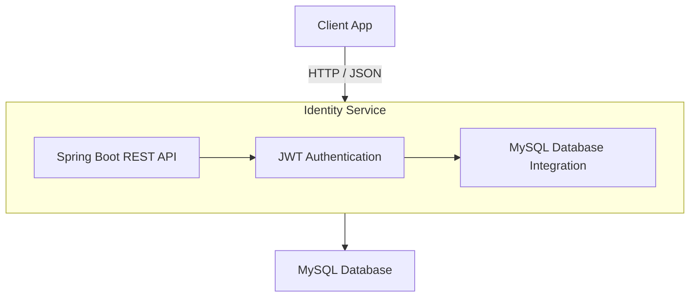

# Identity Service

Identity Service là một microservice phụ trách **xác thực (authentication)** và **phân quyền (authorization)** cho hệ
thống.  
Dịch vụ này được xây dựng bằng **Spring Boot**, sử dụng **MySQL** làm cơ sở dữ liệu và **JWT (JSON Web Token)** để quản
lý phiên đăng nhập an toàn.

---

## Cấu hình ứng dụng

### File `application.yml`

```yaml
spring:
  application:
    name: identity-service
  datasource:
    url: "jdbc:mysql://localhost:3306/identity"
    username: username
    password: password
  jpa:
    hibernate:
      ddl-auto: update
    show-sql: true
    properties:
      hibernate:
        dialect: org.hibernate.dialect.MySQL8Dialect

server:
  port: 8080
  servlet:
    context-path: /identity

jwt:
  signerKey:
```

---

## Kiến trúc tổng quan



---

## Cách chạy dự án

### Yêu cầu hệ thống

- **JDK 17+**
- **Maven 3.8+**
- **MySQL 8.0+**

### Tạo cơ sở dữ liệu

```sql
CREATE DATABASE identity;
CREATE USER 'user'@'localhost' IDENTIFIED BY '123456';
GRANT ALL PRIVILEGES ON identity.* TO 'user'@'localhost';
FLUSH PRIVILEGES;
```

### Chạy ứng dụng

```bash
mvn clean spring-boot:run
```

Hoặc build thành file `.jar`:

```bash
mvn clean package
java -jar target/identity-service-0.0.1-SNAPSHOT.jar
```

Ứng dụng mặc định chạy tại:  
[http://localhost:8080/identity](http://localhost:8080/identity)

---

## Các chức năng chính

- Đăng ký tài khoản (Sign Up)
- Đăng nhập (Sign In)
- Cấp và xác thực JWT token
- Phân quyền (Role-based Authorization)
- Quản lý người dùng (CRUD)
- Tích hợp dễ dàng với các service khác trong hệ thống

---

## Công nghệ sử dụng

| Công nghệ             | Thành phần        |
|-----------------------|-------------------|
| Spring Boot           | Backend Framework |
| MySQL                 | Database          |
| Hibernate / JPA       | ORM               |
| Spring Security + JWT | Security          |
| Maven                 | Build Tool        |
| Java 17               | Language          |

---

## API Mẫu

| Method | Endpoint         | Mô tả                             |    
|--------|------------------|-----------------------------------|
| `POST` | `/auth/register` | Đăng ký người dùng mới            |
| `POST` | `/auth/login`    | Đăng nhập, trả về JWT token       |
| `GET`  | `/users/me`      | Lấy thông tin người dùng hiện tại |
| `GET`  | `/admin/users`   | Quản lý người dùng (chỉ admin)    |


